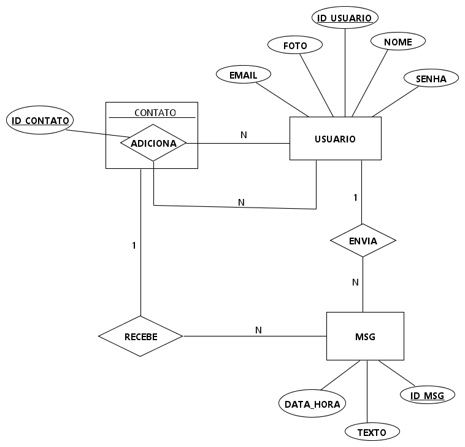

# REST API - WhatsApp Web Light

<p>O WhatsApp Web Light é uma versão web e simplificada do WhatsApp.</p>
<p>Este repositório disponibiliza os endpoints da aplicação e é responsável pela modelagem e os acessos ao banco de dados do sistema.</p>

## Modelagem do Banco de Dados
### Modelo ER


### Mapeamento das tabelas do banco de dados

```
user (id_user PK, name, password, email, Photo);
contact (id_contact PK, user_contact FK, my_contact FK);
msg (id_msg PK, text, date_time, from_user FK, to_contact FK);
```

### Código SQL para a criação das tabelas no PostgreSQL

```
CREATE TABLE users (
    id_user BIGINT,
    name VARCHAR(50) NOT NULL UNIQUE,
    password VARCHAR(100) NOT NULL,
    email VARCHAR(100) NOT NULL,
    photo VARCHAR(100),
    PRIMARY KEY(id_user)
);

CREATE TABLE contact (
    id_contact BIGINT,
    user_contact int NOT NULL,
    my_contact int NOT NULL,
    PRIMARY KEY(id_contact),
    FOREIGN KEY(user_contact) REFERENCES users(id_user) ON DELETE CASCADE,
    FOREIGN KEY(my_contact) REFERENCES users(id_user) ON DELETE CASCADE
);

CREATE TABLE msg (
    id_msg BIGINT,
    text TEXT NOT NULL,
    date_time TIMESTAMP NOT NULL,
    from_user INT NOT NULL,
    to_contact INT NOT NULL,
    PRIMARY KEY(id_msg),
    FOREIGN KEY(from_user) REFERENCES users(id_user),
    FOREIGN KEY(to_contact) REFERENCES contact(id_contact) ON DELETE CASCADE
);
```

### Diagrama de tabelas


## Requisitos do sistema
 - Java17
 - Maven
 - PostgreSQL
 - Spring Boot
    - Spring Data JPA
    - Spring Web
    - PostgreSQL Driver
    - Validation
    - Spring Security
    - JWT

## Endpoints da API
<p>Todos os endpoints que tiverem com anotação ".PROTECTED" precisarão da utilização do TOKEN para o acesso.</p>
<p>O TOKEN é gerado após o login do usuário e o tempo de expiração é de 2 horas.</p>

**/user**
### Criar usuário
```
[POST] http://localhost:2000/user/create
```
**JSON**
<p>Os campos (name, password e email) são obrigatórios.</p>

```
{
    "name":"nome",
    "password":"********",
    "email":"******@*******",
    "photo":"URL"
}
```

### Login de usuário
<p>Após a autenticação será retornado um TOKEN.</p>

```
[POST] http://localhost:2000/user/login
```
**JSON**
```
{
    "name":"nome",
    "password":"********"
}
```

### Buscar usuário pelo nome 
<p>Substitua o campo "{nome}" pelo nome do usuário que deseja buscar.</p>

```
.PROTECTED
[GET] http://localhost:2000/user/name/{nome}
```

### Buscar usuário pelo id
<p>Substitua o campo "{id}" pelo id do usuário que deseja buscar.</p>

```
.PROTECTED
[GET] http://localhost:2000/user/id/{id}
```

### Atualização de usuário
```
.PROTECTED
[PUT] http://localhost:2000/user/update
```
**JSON**
<p>Todos os campos são obrigatórios.</p>

```
{
    "password":"********",
    "email":"******@*******",
    "photo":"URL"
}
```
