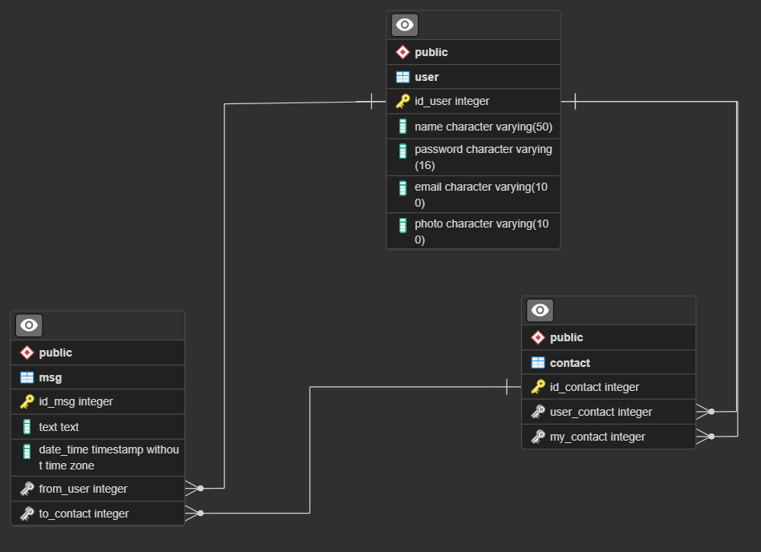

# Repositório Back-End do projeto WhatsApp Web Light

<p>O WhatsApp Web Light é uma versão web e simplificada do WhatsApp.</p>

## Modelagem do Banco de Dados
### Modelo ER


### Mapeamento das tabelas do banco de dados

```
user (id_user PK, name, password, email, Photo);
contact (id_contact PK, user_contact FK, my_contact FK);
msg (id_msg PK, text, date_time, from_user FK, to_contact FK);
```

### Diagrama de tabelas


### Código SQL para a criação das tabelas no PostgreSQL

```
CREATE TABLE users (
    id_user SERIAL,
    name VARCHAR(50) NOT NULL UNIQUE,
    password VARCHAR(16) NOT NULL,
    email VARCHAR(100) NOT NULL,
    photo VARCHAR(100),
    PRIMARY KEY(id_user)
);

CREATE TABLE contact (
    id_contact SERIAL,
    user_contact int NOT NULL,
    my_contact int NOT NULL,
    PRIMARY KEY(id_contact),
    FOREIGN KEY(user_contact) REFERENCES users(id_user) ON DELETE CASCADE,
    FOREIGN KEY(my_contact) REFERENCES users(id_user) ON DELETE CASCADE
);

CREATE TABLE msg (
    id_msg SERIAL,
    text TEXT NOT NULL,
    date_time TIMESTAMP NOT NULL,
    from_user INT NOT NULL,
    to_contact INT NOT NULL,
    PRIMARY KEY(id_msg),
    FOREIGN KEY(from_user) REFERENCES users(id_user),
    FOREIGN KEY(to_contact) REFERENCES contact(id_contact) ON DELETE CASCADE
);
```
